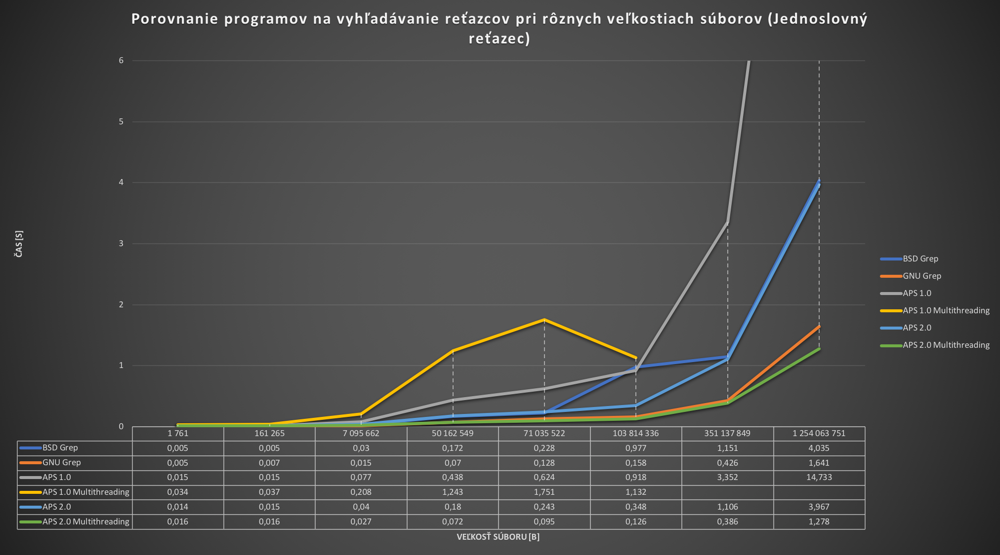

# APS program for string matching using OpenCL
Simple searching string in large text files. User can enter file and pattern he is searching. Program is using Knuth-Morris-Pratt algorithm for searching. 
## Features
* Counting occurances
* Printing offset of occurance
* Printing line and line number
* Multi-threading 

## Installation with clone
```
https://github.com/simonharvan/aps-search-string.git
cd aps-search-string/aps
gcc -framework OpenCL main.c -o <output-file>
```

## Testing 
My program went pretty good in testing 

